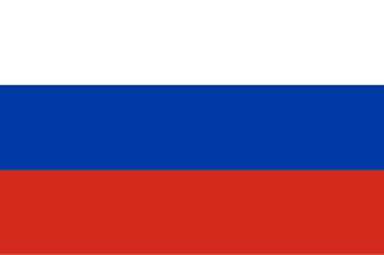

<h1>Welcome</h1>
<h2><b>Introduction</b></h2>

This website offers a light introduction to the <strong>Russian language</strong>.
  

Including:

  <ol>
  <li>The Russian alphabet.</li>
  <li>Basic grammar.</li>
  <li>Fun interactive activities to introduce vocabulary.</li>
</ol>

  

    

    
        

          
Moscow

        

    

  

  

    

        
        

          
St. Petersburg

        

      

  

  

    

        
        

          
The Russian flag

        

    

  

