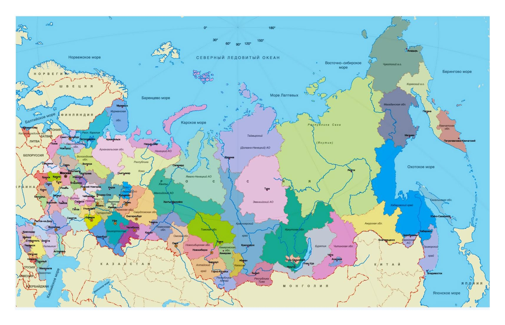

<h1>Welcome</h1>
<h2><b>Introduction</b></h2>

This website offers a light introduction to the <strong>Russian language</strong>.
  

Including:

  <ol>
  <li>The Russian alphabet.</li>
  <li>The difference between imperfective and perfective verbs.</li>
  <li>Fun interactive activities to introduce vocabulary.</li>
</ol>
  

 

 
 
 

<h2>Винни-Пух</h2>
<iframe width="420" height="315"
src="https://www.youtube.com/embed/bEwE4wyz00o">
</iframe>

<pre style="background-color:#dce3e8;">
Russian Winnie-the-Pooh (Винни-Пух) is 
quite different to his English counterpart.
</pre>

 

  

    

    
        

          
Moscow

        

    

  

  

    

        
        

          
St. Petersburg

        

      

  

  

    

        
        

          
A map of Russia

        

    

  

