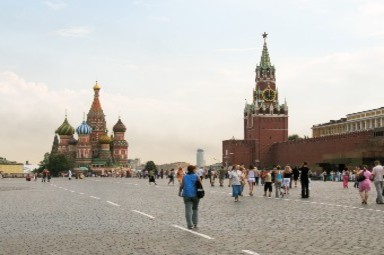
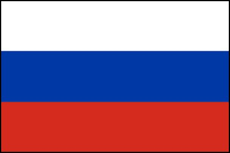

<h1>Welcome</h1>
<h2><b>Introduction</b></h2>

This website offers a light introduction to the <strong>Russian language</strong>.
  

Including:

  <ol>
  <li>The Russian alphabet.</li>
  <li>Basic grammar.</li>
  <li>Fun interactive activities to introduce vocabulary.</li>
</ol>

  

    

    
        

          
The Red Square in Moscow. It is home to the Kremlin, GUM department store, the State History Museum, Lenin's Mausoleum, and of course, St Basil’s Cathedral. All the major streets of Moscow radiate from here. Red Square is the central square of Moscow and the symbolic center of all Russia. 

        

    

  

  

    

        
        

          
The Winter Palace in St. Petersburg. It was the official residence of the Russian Emperors from 1732 to 1917. Today, the palace and its precincts form the Hermitage Museum.

        

      

  

  

    

        
        

          
The Russian flag.

        

    

  

