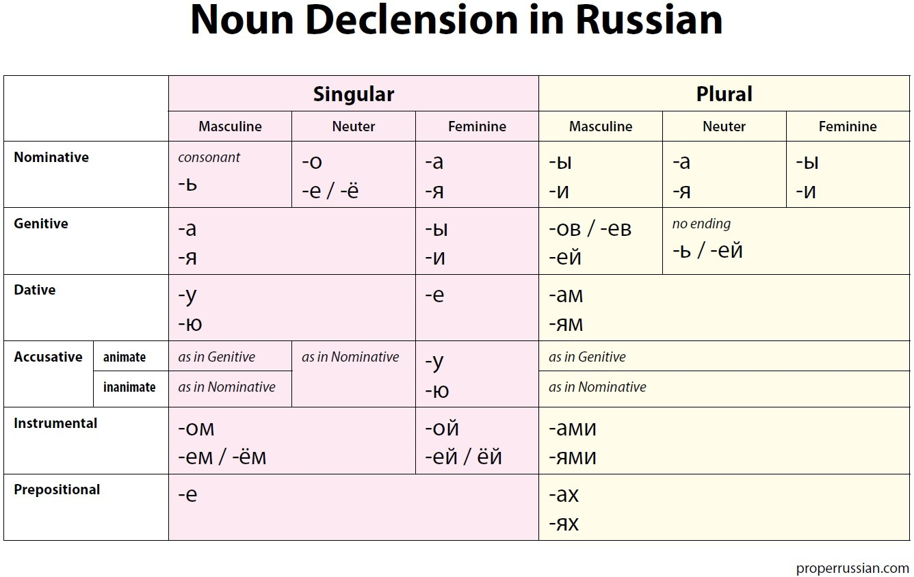

<h1 align="center"> Grammar </h1> 

&nbsp;

This page will provide you with some basic information on the gender of nouns, recognising plural formations, an introduction to the Russian case system and noun declension.

Material sourced from <a href="http://masterrussian.com/">masterrussian.com</a>.

<h2> Part 1: Noun Gender</h2>
<h3> 1.1. Read through the information on the gender of nouns.</h3>

 There are three genders in Russian: <strong>masculine, feminine and neuter</strong>. You can usually determine the gender of a noun by its ending. Here are some basic rules:

<b>Masculine gender:</b> 
	

          <table cellSpacing="0" cellPadding="4" align="center" border="0">
            <tbody>
              <tr align="middle">
                <td width="200" bgcolor="#E8E8E8"><b>Word</b></td>
                <td width="150" bgcolor="#E8E8E8"><b>Ending</b></td>
              </tr>
              <tr align="middle">
                <td>до<u>м</u></td>
                <td>in a consonant</td>
              </tr>
              <tr align="middle">
                <td bgcolor="#E8E8E8">ча<u>й</u></td>
                <td bgcolor="#E8E8E8">in <b>-й</b></td>
              </tr>
            </tbody>
          </table>
	

&nbsp;

<b>Feminine gender:</b> 
	

          <table cellSpacing="0" cellPadding="4" align="center" border="0">
            <tbody>
              <tr align="middle">
                <td width="200" bgcolor="#E8E8E8"><b>Word</b></td>
                <td width="150" bgcolor="#E8E8E8"><b>Ending</b></td>
              </tr>
              <tr align="middle">
                <td>картин<u>а</u></td>
                <td>in <b>-a</b></td>
              </tr>
              <tr align="middle">
                <td bgcolor="#E8E8E8">семь<u>я</u></td>
                <td bgcolor="#E8E8E8">&nbsp;&nbsp;&nbsp;&nbsp;in
                  <b>-я</b>&nbsp;&nbsp;&nbsp;&nbsp;</td>
              </tr>
              <tr align="middle">
                <td>истор<u>ия</u></td>
                <td>in <b>-ия</b></td>
              </tr>
            </tbody>
          </table>
	

&nbsp;

<b>Neuter gender:</b> 
	

          <table cellSpacing="0" cellPadding="4" align="center" border="0">
            <tbody>
              <tr align="middle">
                <td width="200" bgcolor="#E8E8E8"><b>Word</b></td>
                <td width="150" bgcolor="#E8E8E8"><b>Ending</b></td>
              </tr>
              <tr align="middle">
                <td>письм<u>o</u></td>
                <td>&nbsp;&nbsp;&nbsp;&nbsp;in <b>-o</b>&nbsp;&nbsp;&nbsp;&nbsp;</td>
              </tr>
              <tr align="middle">
                <td bgcolor="#E8E8E8">плать<u>e</u></td>
                <td bgcolor="#E8E8E8">&nbsp;&nbsp;&nbsp;&nbsp;in
                  <b>-e</b>&nbsp;&nbsp;&nbsp;&nbsp;</td>
              </tr>
	      <tr align="middle">
                <td>вниман<u>ие</u></td>
                <td>&nbsp;&nbsp;&nbsp;&nbsp;in <b>-ие</b>&nbsp;&nbsp;&nbsp;&nbsp;</td>
              </tr>
              <tr align="middle">
                <td bgcolor="#E8E8E8">вре<u>мя</u></td>
                <td bgcolor="#E8E8E8">&nbsp;&nbsp;&nbsp;&nbsp;in
                  <b>-мя</b>&nbsp;&nbsp;&nbsp;&nbsp;</td>
              </tr>
            </tbody>
          </table>
	

&nbsp;

 <b>NOTE: </b>Nouns ending in the soft sign <b>-ь</b> can be either masculine or feminine: день (day - masculine), жизнь (life - feminine). The best way to tell the gender of such nouns is to memorize it as you progress with your Russian language study.

&nbsp;

<h3> 1.2. Now try answering these questions about Russian noun gender!</h3>

<strong>Remember:</strong> The Russian vowels are <strong>а, э, ы, о, у, я, е, и, ё, ю</strong>
<iframe src="https://h5p.org/h5p/embed/1085037" width="1090" height="821" frameborder="0" allowfullscreen="allowfullscreen" allow="geolocation *; microphone *; camera *; midi *; encrypted-media *"></iframe>

&nbsp;
	

&nbsp;

&nbsp;

<h2>Part 2: Noun Number</h2>
<h3> 2.1. Read through the following information on noun plurality.</h3>

English plurals often end in <b>-s</b>. In Russian, there are more endings to make plurals. They are all summed up in the table:

 

          <table cellSpacing="0" cellPadding="4" align="center" border="0">
            <tbody>
              <tr align="middle">
                <td bgcolor="#E8E8E8"><b>Noun type</b></td>
                <td bgcolor="#E8E8E8"><b>Ending for plural</b></td>
                <td bgcolor="#E8E8E8">&nbsp;&nbsp;&nbsp;&nbsp;&nbsp;<b>Example</b>&nbsp;&nbsp;&nbsp;&nbsp;</td>
              </tr><tr align="middle">
                <td>masculine ending in a hard consonant; 
                  feminine ending in <b>-a</b> </td>
                <td><b>-ы</b>; 
		<b>-ы, -и</b> </td>
                <td>стол - столы улица - улицы чашка - чашки</td>
              </tr>
              <tr align="middle">
                <td bgcolor="#E8E8E8">any nouns
                  ending in <b>-ь</b>, <b>-й</b>, <b>-я</b></td>
                <td bgcolor="#E8E8E8"><b>-и</b></td>
                <td bgcolor="#E8E8E8">двeрь -
                  двери земля - земли</td>
              </tr>
              <tr align="middle">
                <td>masculine and feminine with the stem ending
                  in <b>-к</b>, <b>-г</b>, <b>-x</b>, <b>-ч</b>, <b>-щ</b>, <b>-ж</b>,
                  <b>-ш</b>,</td>
                <td><b>-и</b></td>
                <td>ноЖ - ножи ноГа - ноги</td>
              </tr>
              <tr align="middle">
                <td bgcolor="#E8E8E8">neuter
                  ending in <b>-o</b></td>
                <td bgcolor="#E8E8E8"><b>-a</b></td>
                <td bgcolor="#E8E8E8">окно -
                  окнa</td>
              </tr>
              <tr align="middle">
                <td>neuter ending in <b>-e</b></td>
                <td><b>-я</b></td>
                <td>мoре - моря</td>
              </tr>
            </tbody>
          </table>
	  

&nbsp;

Some nouns are always singular. These are nouns that designate substances <b>кислород, медь</b> (oxygen, copper), food products <b>сахар, мука</b> (sugar, flour), a block of objects <b>мебель</b> (furniture), some actions <b>охота</b> (hunting), feelings <b>любовь, здоровье</b> (love, health), sorts of fabric <b>бархат</b> (velvet), medicine <b>аспирин</b> (aspirin), some vegetables and berries <b>картофель, морковь</b> (potato, carrots).

&nbsp;

<h3> 2.2. Now try answering these questions about Russian noun number!</h3>

&nbsp;

<iframe src="https://h5p.org/h5p/embed/1086679" width="1090" height="821" frameborder="0" allowfullscreen="allowfullscreen" allow="geolocation *; microphone *; camera *; midi *; encrypted-media *"></iframe>

&nbsp;

&nbsp;

&nbsp;

<h2>Part 3: Introduction to the case system</h2>
<h3>3.1. Read the following information on the Russian case system.</h3>

There are six cases in Russian:
	
&nbsp;

          <b>nominative, genitive, dative, accusative, instrumental, and
		  prepositional.</b>
	
&nbsp;

          
<b>1.</b> The nominative case answers the
          questions &quot;who?&quot; or &quot;what?&quot;. It is an initial
          form. All dictionaries give nouns in the nominative.
          <blockquote>
            
<b><i>Студ<u>е</u>нт</i>
            чит<u>а</u>ет</b>&nbsp;&nbsp; <i>The student</i> is reading.

		
cтудент --> cтудент (no change)

          </blockquote>
          
<b>2.</b> The genitive case is used to
          show that something (somebody) belongs or refers to something
          (somebody). It can be translated by &quot;of&quot; in English.
          <blockquote>
            
<b>б<u>е</u>рег<i> рек<u>и</u></i></b>&nbsp;&nbsp;
            the bank <i>of the river</i>

		
река --> реки (the ending -a becomes -и)

          </blockquote>
          
<b>3.</b> The dative case designates that
          something is given or addressed to the person (object).
          <blockquote>
            
<b>Я ид<u>у</u> <i>к врач<u>у</u></i></b>&nbsp;&nbsp;
            I go <i>to the doctor</i> 
            <b>Я да<u>ю</u> <u>э</u>то <i>др<u>у</u>гу</i></b>&nbsp;&nbsp; I give it <i>to
            the friend</i>

		
врач --> врачу (the ending -у is added) 
	      друг --> другу

          </blockquote>
          
<b>4.</b> The accusative case designates
          the object of an action.
          <blockquote>
            
<b>Я чит<u>а</u>ю <i>газ<u>е</u>ту</i></b>&nbsp;&nbsp;
            I read <i>the newspaper</i> 
            <b>Я встр<u>е</u>тил <i>др<u>у</u>га</i></b>&nbsp;&nbsp; I met <i>the
            friend</i>

		  

газета --> газету (the ending -а becomes -у) 
	друг --> друга (the ending -а is added)

          </blockquote>
          
<b>5.</b> The instrumental case is used to
          denote an instrument that helps to make something.
          <blockquote>
            
<b>Я пиш<u>у</u> <i>карандаш<u>о</u>м</i></b>&nbsp;&nbsp;
            I write <i>with a pencil</i>

карандаш --> карандашом (the ending -ом is added)

          </blockquote>
          
<b>6.</b> The prepositional case is used
          to designate a place, or a person (object) that is an object of speech
          and thought. This case is always used with a preposition.
          <blockquote>
            
<b>Он<u>а</u> мечт<u>а</u>ет <i>о
            л<u>е</u>те</i></b>&nbsp;&nbsp; She dreams <i>about the summer</i> 
            <b>Цвет<u>ы</u> сто<u>я</u>т <i>на стол<u>е</u></i></b>&nbsp;&nbsp; The
            flowers are <i>on the table</i>

лето --> лете (the ending -о becomes -е) 
	стол --> столе (the ending -е is added)

          </blockquote>
          
Very often the case of a noun is
          connected with a preposition which stands before it. The nouns,
          adjectives, pronouns and numerals may have different case forms in the
          sentence. Thus, to understand Russian speech and speak Russian
          correctly, it is necessary to learn how to use cases in Russian.

&nbsp;

<h3>3.2. For further reading on each of the cases, see below:</h3>
div { 
padding: 50px;
margin: 0px;
}
<ul>
<li><a href="http://masterrussian.com/aa060400a.shtml">Nominative</a></li>
<li><a href="http://masterrussian.com/aa061500a.shtml">Genitive</a></li>
<li><a href="http://masterrussian.com/aa070100a.shtml">Dative</a></li>
<li><a href="http://masterrussian.com/aa071200a.shtml">Accusative</a></li>
<li><a href="http://masterrussian.com/aa073000a.shtml">Instrumental</a></li>
<li><a href="http://masterrussian.com/aa081500a.shtml">Prepositional</a></li>
</ul>

&nbsp;

&nbsp;

&nbsp;

<h2>Part 4: Noun Declension</h2>
<h3>4.1. Useful reference material for noun declension.
	
&nbsp;

<h3>4.2. Click <a href="http://masterrussian.com/aa052000a.shtml">here</a> for more in-depth information on singular noun declension.</h3>

&nbsp;

<h3>4.3. Click <a href="http://masterrussian.com/aa082100a.shtml">here</a> for more information on plural noun declension.</h3>

